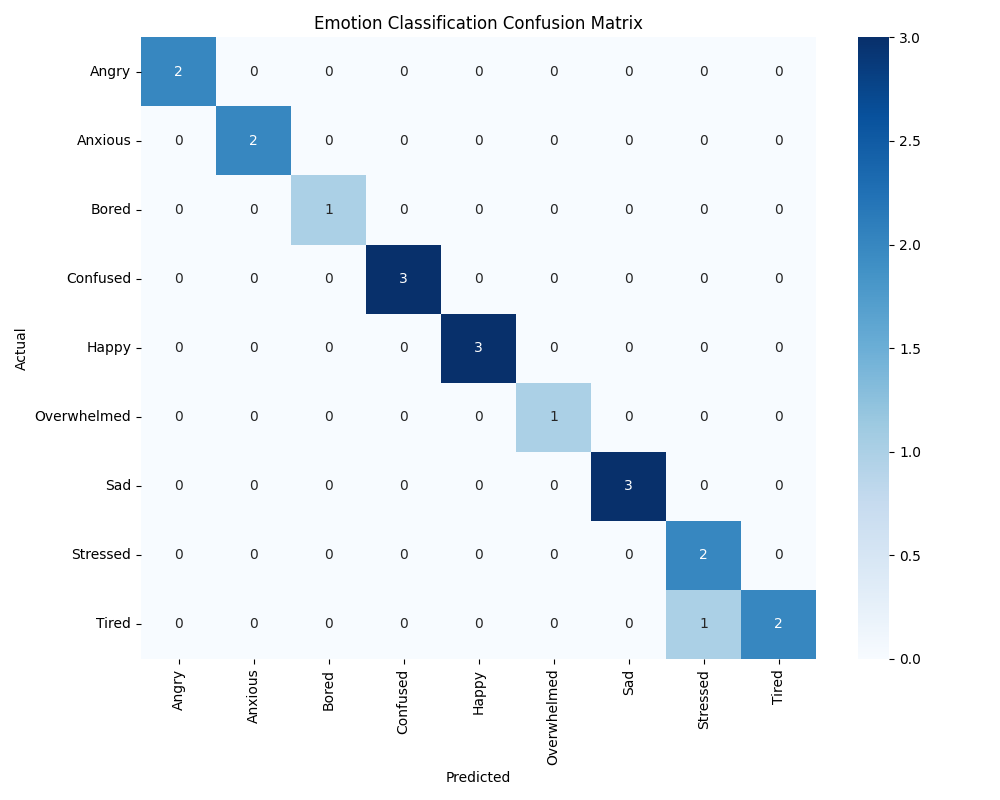

# Model Evaluation Report

**Overall Accuracy**: 95.00%

## Classification Details
```text
              precision    recall  f1-score   support

       Angry       1.00      1.00      1.00         2
     Anxious       1.00      1.00      1.00         2
       Bored       1.00      1.00      1.00         1
    Confused       1.00      1.00      1.00         3
       Happy       1.00      1.00      1.00         3
 Overwhelmed       1.00      1.00      1.00         1
         Sad       1.00      1.00      1.00         3
    Stressed       0.67      1.00      0.80         2
       Tired       1.00      0.67      0.80         3

    accuracy                           0.95        20
   macro avg       0.96      0.96      0.96        20
weighted avg       0.97      0.95      0.95        20

```

## Confusion Matrix

