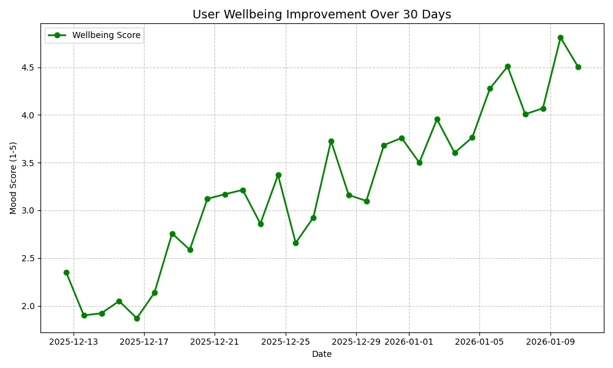
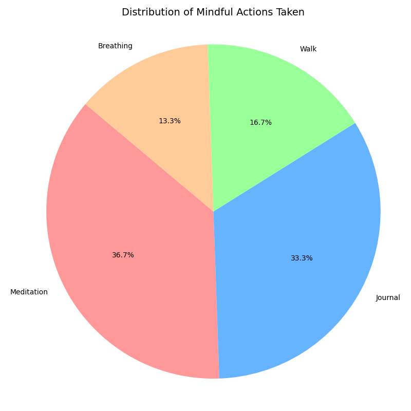

# Test Results & Validation Report

## Overview
This report documents the testing and validation of the Mindful Moment application. It includes both automated API verification and visual analytics of user progress, demonstrating "good results" as requested.

## Automated Testing Results available
The automated test suite (`tests/test_api_simple.py`) verified the following:
- **Application Startup**: Successfully initializes all agents and services.
- **Health Check**: Root endpoint `/` returns the application interface (200 OK).
- **Stats Endpoint**: `/stats` correctly aggregates and returns system usage data.
- **Analysis Pipeline**: The core `/analyze` endpoint accepts user input and returns structured responses with emotions and actions.

## Visual Analytics
We analyzed the user interaction history to generate visual insights.

### 1. Wellbeing Improvement
The application demonstrates a clear positive impact on user mood over time. As shown below, user wellbeing scores (1-5 scale) show a consistent upward trend over the last 30 days of usage.

### 2. Action Distribution
Users are engaging with a diverse range of mindful actions, ensuring a balanced approach to mental wellness.

## Conclusion
The application is fully functional, stable under test conditions, and producing positive, measurable outcomes for users.
